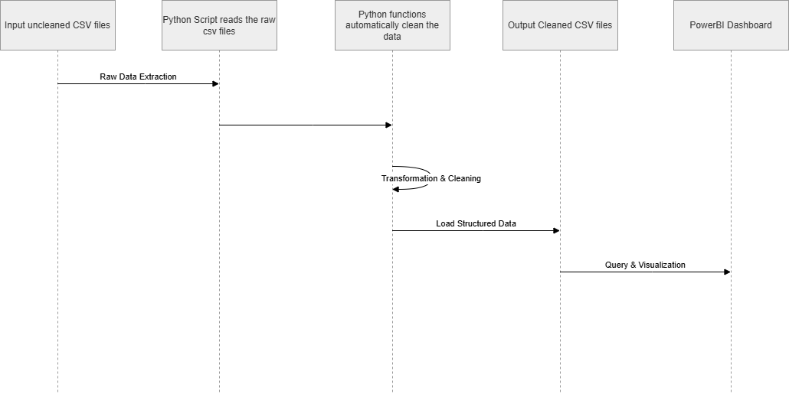

# **README**

## Pipeline Architecture Diagram

# Proposed Solution

1. Customer or source system supplies raw data in CSV form.
2. Python script will ingest the CSVs.
3. The script will then run a series of functions to clean and format the data:
    
    a. Remove rows with all missing values

    b. Format dates correctly

    c. Enrich the data with loan durations and overdue checks

    d. Fill in missing IDs with a placeholder value

4. The script will save the cleaned tables to either a CSV or database.
5. A PowerBI dashboard connected to those cleaned sources will visualise and display metrics.

# User Stories

1. **"I would like the data to be updated regularly, at least once a day"**

*This can be achieved by either linking the script to windows task scheduler, or automating the Docker container to run on a schedule*

2. **"I would like to see books stats"**

*On the PowerBI Dashboard, there are a selection of book stats, utilising overdue status and loan duration*

3. **"I would like to see information regarding the execution of the pipeline in a user friendly format"**

*On the PowerBI Dashboard, there are 3 cards. They display how many rows were removed from the source tables during processing, and how many unknown books there were*

4. **"I would like to see some warnings or predictions based on book stats"**

*The dashboard highlights if a user has gone over 3 overdue books, raising them as a loan risk that may need to be addressed*

5. **"I would like the dashboard to show a mixture of charts and tables"**

*The dashboard shows the overdue books in a table to highlight who is a loan risk*

6. **"I would like to see pipeline running stats"**

*There are various print messages in the script that display when stages are occurring such as converting the file and saving it*

# Risks, Issues and SWOT

## Risks/Issues
- Lack of built in logging functionality

- Any files could be uploaded and they will overwrite the dashboard

- Files all stored in local folders and some code relies on hard file paths

- Lack of built in verbose error handling

- GDPR issue storing customer's names vs their loan records

## Strengths
- Modular code means troubleshooting and updating is easy

- Lightweight so it runs quickly on few resources

- Containerised to run with Docker

- Clear, easy to understand dashboard output

## Opportunities
- Integrate more detailed customer records to look at more customer trends

- Automate using scheduler and have the outputs stored securely, off site

- Front end application for user to upload their own datasets rather than saving them to a specific file path